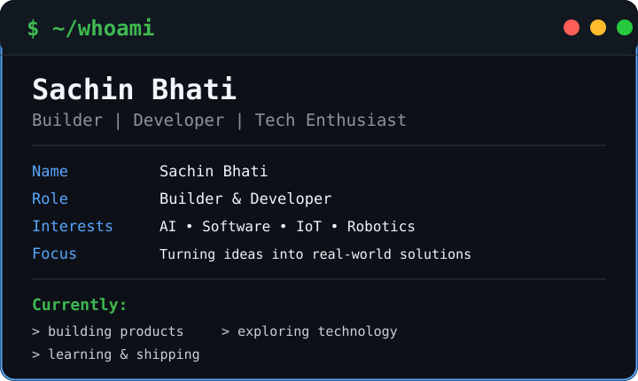
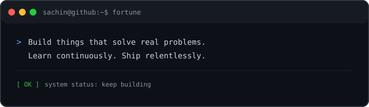

<h3><code>sachin@github:~$ whoami</code></h3>

<table>
<tr>
<td width="42%" align="center" valign="middle">

</td>

<td width="58%" valign="middle">

</td>
</tr>
</table>

 

<h3><code>sachin@github:~$ github.activity</code></h3>

<picture>
  <source
    media="(prefers-color-scheme: dark)"
    srcset="https://github.com/sachinbhati779/sachinbhati779/blob/output/github-contribution-grid-snake-dark.svg"
  />
  <source
    media="(prefers-color-scheme: light)"
    srcset="https://github.com/sachinbhati779/sachinbhati779/blob/output/github-contribution-grid-snake.svg"
  />
  
</picture>

## `$ stack`

### Languages

### Frameworks & Backend

### Tools & Platforms

### Data & AI

<h3><code>sachin@github:~$ fortune</code></h3>

